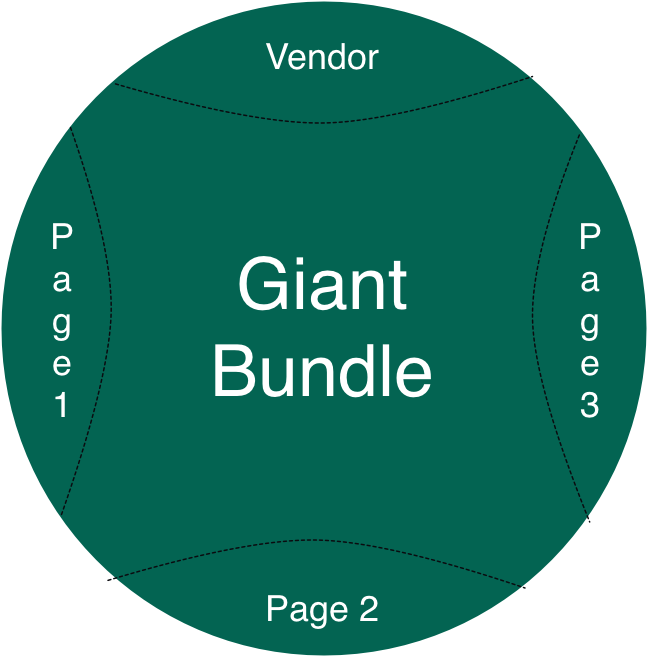
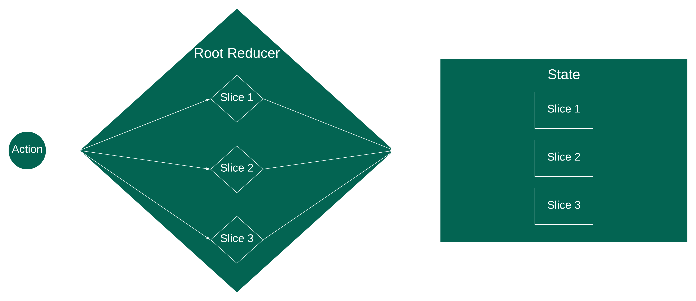
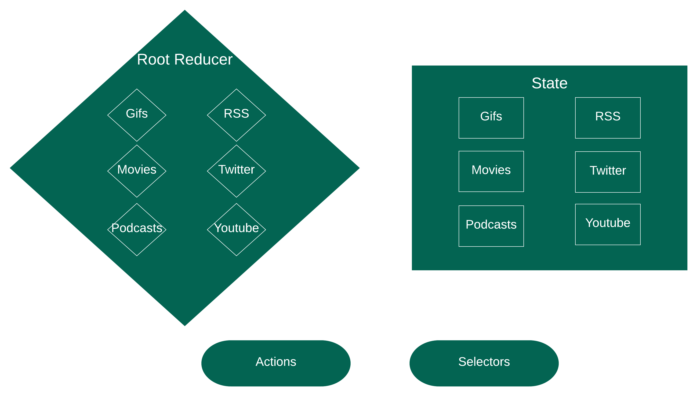
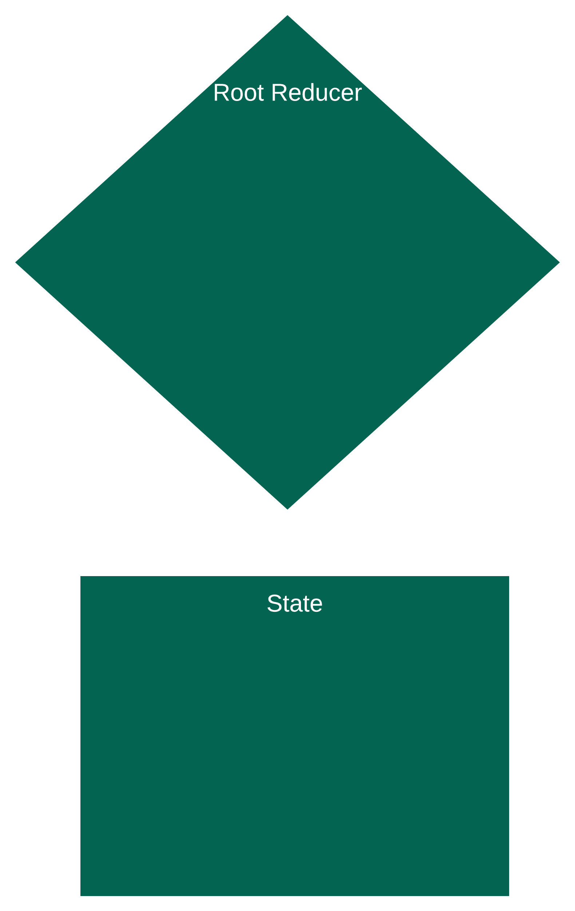
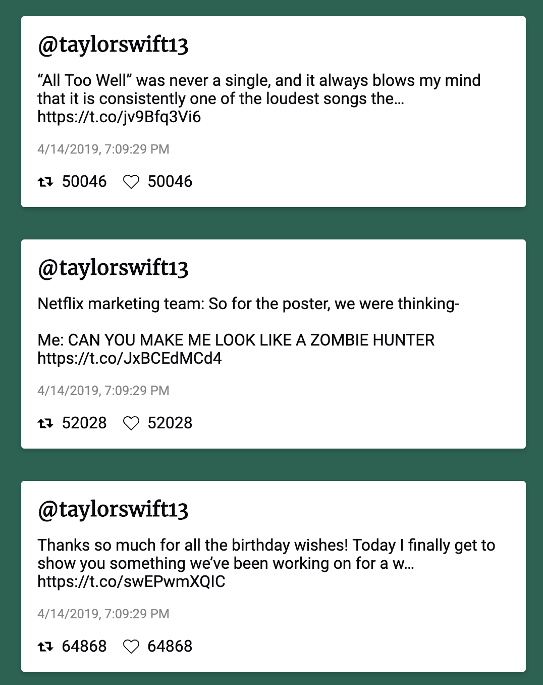
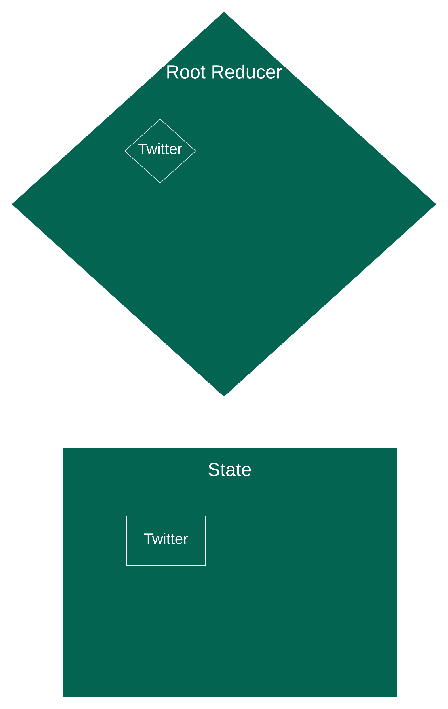
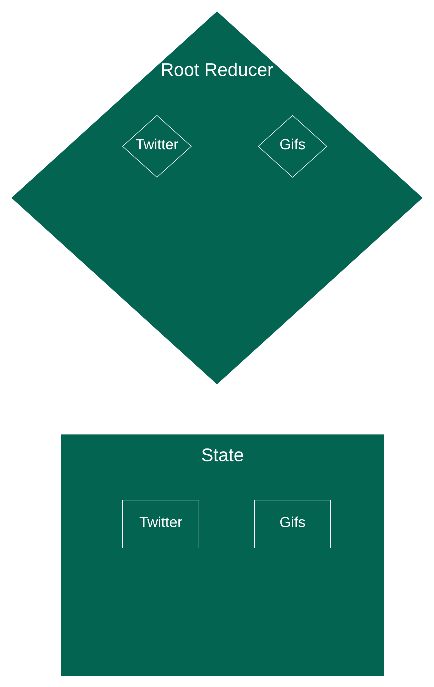
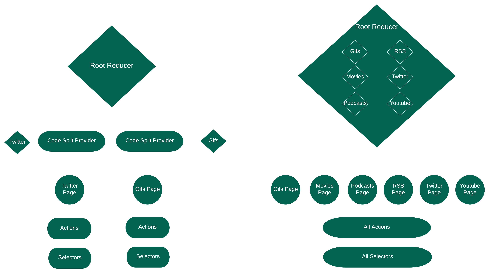

import {Appear, Code, Head, Image, Notes} from 'mdx-deck';
import {AppearList} from './src/appear-list';
import {NotesList} from './src/notes-list';
import TallImage from './src/tall-image';
import AboutMe from './src/about-me';
import {CodeSurfer} from 'mdx-deck-code-surfer';

export {default as theme} from './src/theme';

<Head>
  <title>Building a Code Split React App</title>
</Head>

# Building a Typesafe Code Split React-Redux Application

---

<AboutMe />

---

# Let’s talk about single page apps

---

<TallImage src="assets/timber.gif" />

---

<TallImage src="assets/create-react-app.png" />

---

## create-react-app

<AppearList>
  <li>💻 yarn add redux</li>
  <li>💻 yarn add typescript</li>
  <li>💻 yarn add lodash</li>
  <li>⌨️ Write a lot of javascript</li>
  <li>⌨️ Write a lot of css</li>
</AppearList>
---
<TallImage src='assets/heaviest-objects.jpg' />
---
# 10 MB of JavaScript
<Notes>
  While this might not seem big in the world of HD streaming, this is actually quite big
</Notes>
---
<table>
	<thead>
		<tr>
			<td>Country</td>
			<td>Average Speed</td>
			<td>Time</td>
		</tr>
	</thead>
	<tbody>
		<tr>
			<td>South Korea</td>
			<td>28.6 Mbps </td>
			<td>2.80s</td></tr>
		<tr>
			<td>Norway</td>
			<td>23.5 Mbps </td>
			<td>3.40s</td></tr>
		<tr>
			<td>Sweden</td>
			<td>22.5 Mbps </td>
			<td>3.56s</td></tr>
		<tr>
			<td>Hong Kong</td>
			<td>21.9 Mbps </td>
			<td>3.65s</td></tr>
		<tr>
			<td> Switzerland</td>
			<td>21.7 Mbps </td>
			<td>3.69s</td></tr>
		<tr>
			<td>Finland</td>
			<td>20.5 Mbps </td>
			<td>3.90s</td></tr>
		<tr>
			<td>Singapore</td>
			<td>20.3 Mbps </td>
			<td>3.94s</td></tr>
		<tr>
			<td>Japan</td>
			<td>20.2 Mbps </td>
			<td>3.96s</td></tr>
		<tr>
			<td>Denmark</td>
			<td>20.1 Mbps </td>
			<td>3.98s</td></tr>
		<tr>
			<td>United States</td>
			<td>18.7 Mbps </td>
			<td>4.28s</td></tr>
	</tbody>
</table>
---
# How do we deal with this
---
# Code split
---

	<h2>One Big Synchronous Bundle</h2>
	

<Notes>
  <ul>
    <li>This is the entire 10MB</li>
    <li>We wait for the entire bundle to load</li>
    <li>The one advantage here is once this loads we have all our JS</li>
  </ul>
</Notes>
---

	<h2>Many Small Lazy Loaded Bundles</h2>
	

<Notes>
  <ul>
    <li>Each bundle is small</li>
    <li>Vendor bundle contains React/Redux/Lodash whatever</li>
    <li>We load the page when we need them, or at least make sure they don't block what we do need</li>
  </ul>
</Notes>

---

# This is not new

---

<Notes>
<ul>
  <li>Routes - php, rails, django </li>
  <li>Vendor (jQuery, Underscore, Backbone) - Cached on every page</li>
  <li>Page bundle (App Code) - Changes more often</li>
</ul>
</Notes>
---
# Async Code Splitting
<Notes>
  <ul>
    <li>The main thing that's changed is most of our code lives in the browser</li>
  </ul>
</Notes>
---
<CodeSurfer
  title="Synchronous Import"
  code={require("!raw-loader!./snippets/import-sync.ts").default}
  lang="typescript"
  showNumbers={false}
  dark={true}
	steps={[{lines: [1]}]}
/>

---

<CodeSurfer
  title="Asynchronous Import"
  code={require('!raw-loader!./snippets/import-async.ts').default}
  lang="typescript"
  showNumbers={false}
  dark={true}
  steps={[{lines: [3]}]}
/>

---

# React gives us some pretty great wrappers around this

---

# Lazy/Suspense

---

<CodeSurfer
  code={require("!raw-loader!./snippets/lazy-suspense.ts").default}
  lang="typescript"
  showNumbers={false}
  dark={true}
	steps={[{lines: [1,6, 8]}]}
/>
---
# These are typesafe!
<Notes>
	More on types later
</Notes>
---
<TallImage src="assets/obama-done-here.gif" />
---
<Image style={{display: "flex", flexDirection: "column", justifyContent: "center"}} src="assets/matrix.gif">
	<h1>Data Layer</h1>
</Image>
---
# Good tooling doesn’t really exist here
---
<TallImage style={{padding: 50}} src="assets/redux.png" />
---
<TallImage style={{padding: 10}} src="assets/data-flow.png" />
<Notes>
  <ul>
    <li>State - The dictionary/map (key/value) object that stores all of our data</li>
    <li>View - The react layer rendering from state, taken as props</li>
    <li>Action - Events, deltas emitted by the view</li>
    <li>Reducer - Receives actions and updates the state</li>
    <li>Store - the combination of Reducer + State + Dispatch</li>
  </ul>
</Notes>
---

<Notes>
  <ul>
    <li>Root Reducer is the only reducer redux knows about</li>
    <li>It's built of many smaller reducers called slices or namespaces</li>
    <li>A single action comes in and the root reducer gives it to every inner reducer</li>
    <li>This state is then combined into the big state object we read</li>
    <li>Which is also broken up into various slices</li>
  </ul>
</Notes>
---
# Namespace == Slice
<Notes>
  Just a bit of terminalogy to keep myself out of trouble.
</Notes>
---
# Demo: Slytherin.dev
<Notes>
	Swap tabs to live demo, only show what it does
</Notes>
---
<h2>Naive Implementation</h2>

---
<CodeSurfer
  code={require("!raw-loader!./snippets/naive.ts").default}
  lang="typescript"
  showNumbers={false}
  dark={true}
	steps={[
    {range: [6,13], title: "State Shape"},
    {range: [1,4], title: "Namespaces"},
    {range: [15,18], title: "Actions"},
    {range: [20,28], title: "Root Reducer"},
    {range: [30,36], title: "Gifs Reducer"},
    {range: [37,39], title: "Gifs Selector", note:"our selectors always return the right thing"},
  ]}
/>
<Notes>
  <ul>
    <li>State Shape</li>
    <li>Namespaces</li>
    <li>Actions - Discriminated Union of All Action types</li>
    <li>Root Reducer - We're just gonna show the giphy namespace</li>
    <li>Gifs Reducer</li>
    <li>Gifs Selector</li>
  </ul>
</Notes>
---
<CodeSurfer
  code={require("!raw-loader!./snippets/safety.ts").default}
  lang="typescript"
  showNumbers={false}
  dark={true}
	steps={[
    {range: [1,9], title: "Wins From Typing"},
    {range: [10,15], title: "Actions"},
    {range: [17,22], title: "Selectors"},
    {range: [28, 32], title: "Reducer"},
    {range: [28,44], title: "Reducer"},
    {lines: [34], title: "FetchGifs"},
    {range: [24,28], title: "FetchGifs"},
    {lines: [25], title: "FetchGifs"},
    {lines: [26], title: "FetchGifs"},
    {range: [34,41], title: "Reducer"},
    {range: [37,38], title: "Reducer"},
    {range: [39,40], title: "Reducer"},
    {range: [34,41], title: "Reducer"},
  ]}
/>

<Notes>
  <ul>
    <li>Store is statically typed with a dispatch function that knows shape and all possible actions</li>
    <li>Actions - We can only dispatch actions we know about</li>
    <li>Selectors - We can only access data we know about</li>
    <li>Reducer signature - knows the shape of the namespace and all possible actions</li>
    <li>Deep dive into FetchGifs </li>
  </ul>
</Notes>
---
<h2>Naive Implementation</h2>

---
# Code Splitting
---
# Actions are *easy* to codesplit
---
<CodeSurfer
  code={require("!raw-loader!./snippets/simple-action.ts").default}
  lang="typescript"
  showNumbers={false}
  dark={true}
  steps={[
    {range: [1,9]},
  ]}
/>
---
# Selectors are _easy_ to codesplit
---
<CodeSurfer
  code={require("!raw-loader!./snippets/simple-selector.ts").default}
  lang="typescript"
  showNumbers={false}
  dark={true}
	steps={[
    {range: [1,9]},
  ]}
/>
---
# Reducers are _hard_ to codesplit
---
# We need the root reducer at store creation
---

<CodeSurfer
  code={require("!raw-loader!./snippets/create-store").default}
  lang="typescript"
  showNumbers={false}
  dark={true}
/>
---
<TallImage src="assets/root-reducer.png" />
<Notes>
  The root reducer is composed of every possible reducer we want to include
</Notes>
---
# Dropbox Scale
---
# We built this for Dropbox
<AppearList>
		<li>👩‍💻 200+ engineers working on the same codebase</li>
		<li>📚 25 Namespaces</li>
		<li>📘 Any given page might need a permutation of 5-10</li>
		<li>🌎 NY, SEA, SF, TLV</li>
</AppearList>
---
# This has to run on every page.
---
# We can’t guarantee that single a reducer is never expensive.
---
<TallImage src="assets/root-reducer.png" />
<Notes>
  <ul>
    <li>Theres nothing stopping a single team from including all of lodash as a dependency in their reducer.</li>
    <li>Even if we could, there could be a good reason for it to be expensive</li>
  </ul>
</Notes>
---

# We’ve gotta figure out how to codesplit the reducer

---

# Slytherin.dev

---
# Navigate to Twitter Page

---
# Navigate to Gifs Page

  

    
    
  

  

---
# What do we want to optimize for?
---
# Soundness
---
# Works perfectly, or completely breaks, nothing in between
---
# Failure Modes
<ul>
	<li>🤫 Silent errors</li>
	<li>🤔 Works on my machine</li>
	<li>🏃‍♀️ Bugs around render order</li>
</ul>
<Notes>
	Partially loaded state where we don't know what is/isn't loaded.
</Notes>
---
# How do we enforce Soundness
---
# Compile Time
<Notes>
  Typechecking
</Notes>
---
# Runtime
<Notes>
  When the code is executing in the browser
</Notes>
---
# We should have strong runtime assertions to check data is there, so we can fail fast.
<NotesList>
	<li>Feature, not a bug, that any given slice of the state may or may not be available when a selector is called.</li>
	<li>We need to isolate where failure modes can happen as a result of codesplitting</li>
	<li>We do not want developers to be able to call a selector if a namespace is not registered.</li>
</NotesList>
---
# Good developer experience
<Notes>
	Abstractions around code splitting, engineers shouldn’t have to think about code splitting when they’re building features.
</Notes>
---
<CodeSurfer
  code={require("!raw-loader!./snippets/app.tsx").default}
  lang="typescript"
  showNumbers={false}
	title="app.tsx"
  dark={true}
	steps={[
		{range: [14, 25]},
		{range: [35, 49]},
    {lines: [39, 40, 41, 45, 46, 47]},
	]}
/>
---
<CodeSurfer
  code={require("!raw-loader!./snippets/gifs-page.tsx").default}
  lang="typescript"
  showNumbers={false}
	title="gifs-page.tsx"
  dark={true}
	steps={[
		{lines: [54,56]},
		{lines: [47, 49]},
		{lines: [22]},
	]}
/>
---

# Developer Experience ✅

<Notes>
  <ul>
    <li>This has a similar cognitive footprint to Lazy/Suspense.</li>
    <li>Nice experience for the gifs team, remember big company means teams for small features.</li>
  </ul>
</Notes>
---
# Hows this work?
---
<CodeSurfer
  code={require("!raw-loader!./snippets/code-split-provider.tsx").default}
  lang="typescript"
  showNumbers={false}
	title="provider.tsx"
  dark={true}
	steps={[
    {range: [9, 18]},
		{lines: [13, 16]},
	]}
/>
<NotesList>
<li>Codesplit provider</li>
<li>getStoreAndRegisterReducers + react/redux provider</li>
</NotesList>
---
<CodeSurfer
  code={require("!raw-loader!./snippets/store.ts").default}
  lang="typescript"
  showNumbers={false}
	title="store.ts"
  dark={true}
	steps={[
		{range: [34, 46]},
		{range: [37, 43]},
		{range: [18, 33]},
		{range: [23, 32]},
		{tokens: {28: [2], 29: [1]}},
	]}
/>
<NotesList>
  <li>getStoreAndRegisterReducers</li>
  <li>getStoreAndRegisterReducers body</li>
  <li>registerReducers</li>
  <li>registerReducers body</li>
  <li>replaceReducer + combineReducer</li>
</NotesList>
---
<CodeSurfer
  code={require("!raw-loader!./snippets/gifs-page.tsx").default}
  lang="typescript"
  showNumbers={false}
	title="gifs-page.tsx"
  dark={true}
	steps={[
			{range: [54,56]},
	]}
/>
---
# What about typing?
---
<h2>Runtime vs Compile Time</h2>

---
<CodeSurfer
  code={require("!raw-loader!./snippets/types.ts").default}
  lang="typescript"
  showNumbers={false}
	title="types.ts"
  dark={true}
	steps={[
			{range: [43,50]},
			{lines: [51]},
	]}
/>
<NotesList>
  <li>FullStore</li>
  <li>StoreShape</li>
</NotesList>
---
# Selector Layer
<NotesList>
  <li>This is the single point of failure</li>
</NotesList>

---

<CodeSurfer
  code={require("!raw-loader!./snippets/gifs-selectors.ts").default}
  lang="typescript"
  showNumbers={false}
	title="gifs/selectors.ts"
  dark={true}
	steps={[
			{range: [4,9]},
			{lines: [2, 8]},
	]}
/>
<NotesList>
  <li>getGifsForId</li>
  <li>getStateAtNamespace</li>
</NotesList>

---

<CodeSurfer
  code={require("!raw-loader!./snippets/selectors.ts").default}
  lang="typescript"
  showNumbers={false}
	title="selectors.ts"
  dark={true}
	steps={[
			{range: [3,14]},
			{range: [3,6]},
			{lines: [4]},
	]}
/>
<NotesList>
  <li>getStateAtNamespace</li>
  <li>Function Signature</li>
  <li>state: StoreShape</li>
</NotesList>
---
<CodeSurfer
  code={require("!raw-loader!./snippets/types.ts").default}
  lang="typescript"
  showNumbers={false}
	title="types.ts"
  dark={true}
	steps={[
			{range: [43,51]},
	]}
/>
---
<CodeSurfer
  code={require("!raw-loader!./snippets/selectors.ts").default}
  lang="typescript"
  showNumbers={false}
	title="selectors.ts"
  dark={true}
	steps={[
      {lines: [4]},
			{tokens: {1:[3,5], 4: [2], 6: [3], 7:[4]}},
      {tokens: {1:[7], 3:[6,7,8,9,10], 5: [3], 6: [5], 7:[6]}},
	]}
/>
<NotesList>
  <li>state: StoreShape</li>
  <li>StoreShape + FullStore</li>
  <li>K extends NamesapceKey</li>
</NotesList>

---

<CodeSurfer
  code={require("!raw-loader!./snippets/types.ts").default}
  lang="typescript"
  showNumbers={false}
	title="types.ts"
  dark={true}
	steps={[
			{lines: [53]},
      {tokens: {
        44: [2],
        45: [2],
        46: [2],
        47: [2],
        48: [2],
        49: [2],
      }}
	]}
/>
<NotesList>
  <li>NamespaceKey = keyof StoreShape</li>
  <li>Discriminated Union Of these types</li>
</NotesList>

---

<CodeSurfer
  code={require("!raw-loader!./snippets/selectors.ts").default}
  lang="typescript"
  showNumbers={false}
	title="selectors.ts"
  dark={true}
	steps={[
      {tokens: {1:[7], 3:[6,7,8,9,10], 5: [3], 6: [5], 7:[6, 14]}},
      {tokens: {6: [3,4,5,6], 7:[4,5,6,7, 12,13,14]}},
	]}
/>
<NotesList>
  <li>K extends NamesapceKey</li>
  <li>FullStore[K]</li>
</NotesList>

---

<CodeSurfer
  code={require("!raw-loader!./snippets/types.ts").default}
  lang="typescript"
  showNumbers={false}
	title="types.ts"
  dark={true}
	steps={[
      {tokens: {
        44: [5],
        45: [5],
        46: [5],
        47: [5],
        48: [5],
        49: [5],
      }}
	]}
/>
<NotesList>
  <li>Namespaces</li>
</NotesList>

---

<CodeSurfer
  code={require("!raw-loader!./snippets/selectors.ts").default}
  lang="typescript"
  showNumbers={false}
	title="selectors.ts"
  dark={true}
	steps={[
      {lines: [7]},
      {range: [9,11]},
      {lines: [13]},
	]}
/>
<NotesList>
  <li>const slice</li>
  <li>throw</li>
  <li>return</li>
</NotesList>
---

# Actions

---

<CodeSurfer
  code={require('!raw-loader!./snippets/types.ts').default}
  lang="typescript"
  showNumbers={false}
  title="types.ts"
  dark={true}
  steps={[{range: [4, 33]}, {range: [5, 7]}]}
/>

<NotesList>
  <li>Show Imports</li>
  <li>Gifs types</li>
</NotesList>
---
# Tradeoff: Loss of modularization
<NotesList>
  <li>We're rounding up all possible actions types</li>
  <li>
    Actions are historically just functions but here we're collecting types
  </li>
  <li>It ends up being worth it</li>
  <li>typescript just yells at you before you make your commit</li>
  <li>we need to coordinate to prevent conflicts</li>
</NotesList>

---

<CodeSurfer
  code={require("!raw-loader!./snippets/types.ts").default}
  lang="typescript"
  showNumbers={false}
	title="types.ts"
  dark={true}
	steps={[
			{range: [57,65]},
      {range: [86,91]},
      {lines: [88]},
      {lines: [87]},
			{range: [68,84]},
	]}
/>
<NotesList>
  <li>Dispatch = ThunkDispatch + Store</li>
  <li>SlytherinStandardAction</li>
  <li>slytherinId</li>
  <li>type: AllActionTypes, this is all possible strings</li>
  <li>AllActionTypes + AllActions, we've rounded up every string and shape</li>
  <li>Where are these coming from?</li>
</NotesList>
---
<CodeSurfer
  code={require("!raw-loader!./snippets/gifs-types.ts").default}
  lang="typescript"
  showNumbers={false}
	title="gifs/types.ts"
  dark={true}
	steps={[
			{range: [28,31]},
			{range: [16,27]},
	]}
/>
<NotesList>
  <li>GifActions</li>
  <li>FetchGifSuccess + FetchGifError</li>
</NotesList>
---
<CodeSurfer
  code={require("!raw-loader!./snippets/gifs-reducer.ts").default}
  lang="typescript"
  showNumbers={false}
	title="gifs/reducer.ts"
  dark={true}
	steps={[
			{range: [6,9]},
			{range: [13,31]},
			{range: [14,19]},
	]}
/>
---
# Thats how it works
---
# Back To Our Goals
---
# Soundness
---
# Developer Experience
---

&#x3C;CodeSplitProvider /&#x3E;

<NotesList>
  <li>CodeSplitProvider garauntees reducers get registered</li>
</NotesList>
---

getStateAtNamespace()

<NotesList>
  <li>getStateAtNamespace ensures we fail fast if something goes wrong</li>
</NotesList>

---

types.ts

<NotesList>
  <li>types.ts ensures we never dispatch an action we can't handle</li>
</NotesList>

---

# Code Available at

https://github.com/matthew-gerstman/slytherin.dev

---

# Blog Post

https://www.matthewgerstman.com/tech/redux-code-split-typecheck/

---

# References

<ul>
  <li>
    https://mariusschulz.com/blog/typescript-2-4-dynamic-import-expressions
  </li>
  <li>
    https://en.wikipedia.org/wiki/List_of_countries_by_Internet_connection_speeds
  </li>
  <li>
    https://mariusschulz.com/blog/typescript-2-4-dynamic-import-expressions
  </li>
</ul>

---

# Thank You!

---

<AboutMe />
